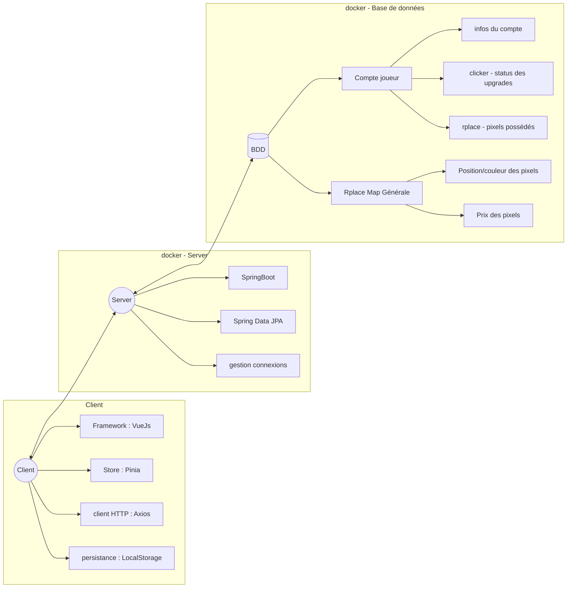

Projet de développement web 2026

Status de la communication avec Gitlab
[](https://github.com/babycrashdev/m1_dwa/actions/workflows/GitlabAutoPush.yml)

CookieCliker/Rplace

Proposition d'architecture



---
## Lancement application

### 1. Backend & Infrastructure (Docker)
```bash
# Compiler le serveur
cd backend/rplaceserv
mvn clean package

# Lancer la DB et l'API
cd backend
docker-compose up -d
```

### 2. Frontend (Vue.js)
```bash
# Lancer le client
cd frontend/rplace-client
npm install
npm run dev
```
---
**Accès :**
- Frontend : http://localhost:5173
- API : http://localhost:8080
