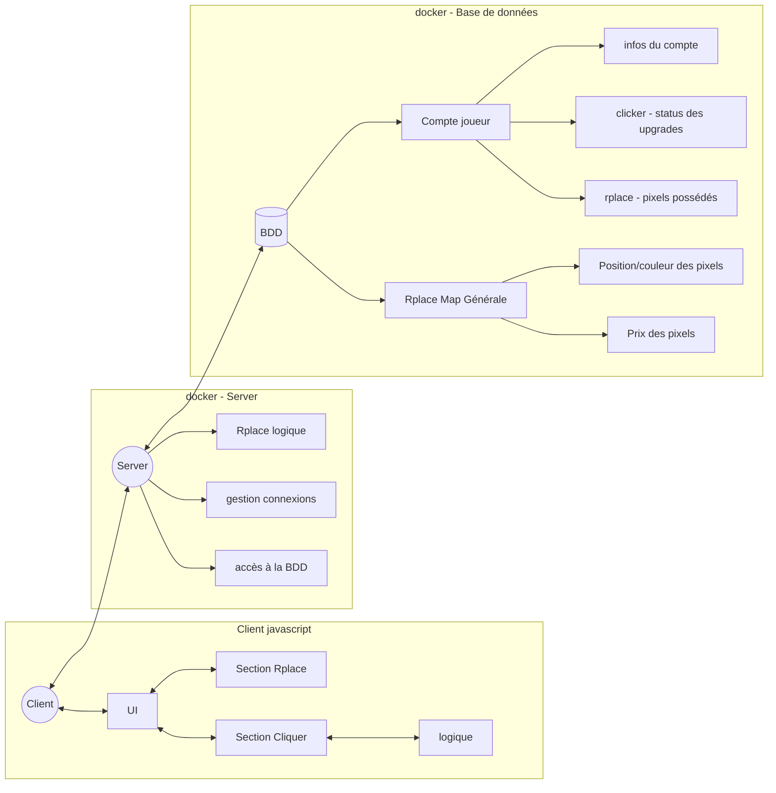

Projet de développement web 2026

CookieCliker/Rplace

Proposition d'architecture

```mermaid
graph LR

C((Client)) <--> S((Server))
S <--> B[(BDD)]

subgraph Client javascript
C <--> U[UI]
U <--> U1[Section Rplace]
U <--> U2[Section Cliquer]
U2 <--> F[logique]
end

subgraph docker - Server
S --> S1[Rplace logique]
S --> S2[gestion connexions]
S --> S3[accès à la BDD]
end
subgraph docker - Base de données
B --> P[Compte joueur]
P --> P1[infos du compte]
P --> P2[clicker - status des upgrades ]
P --> P3[rplace - pixels possédés]
B --> M[Rplace Map Générale]
M --> M1[Position/couleur des pixels]
M --> M2[Prix des pixels]
end


```
