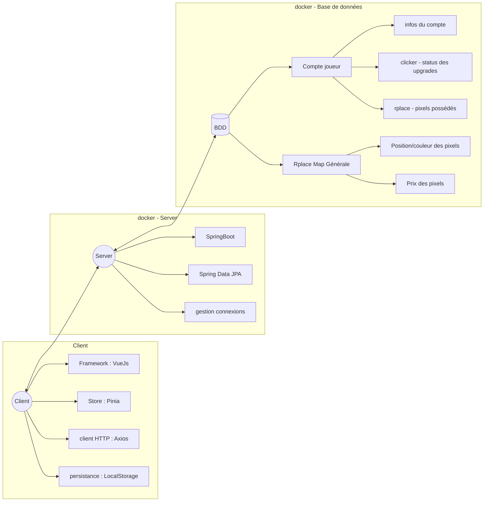

Projet de développement web 2026

Status de la communication avec Gitlab

CookieCliker/Rplace

Proposition d'architecture

```mermaid
graph LR

C((Client)) <--> S((Server))
S <--> B[(BDD)]

subgraph Client
C --> C1[Framework : VueJs]
C --> C2[Store : Pinia]
C --> C3[client HTTP : Axios]
C --> C4[persistance : LocalStorage]
end

subgraph docker - Server
S --> S1[SpringBoot]
S --> S4[Spring Data JPA]
S --> S2[gestion connexions]
end
subgraph docker - Base de données
B --> P[Compte joueur]
P --> P1[infos du compte]
P --> P2[clicker - status des upgrades ]
P --> P3[rplace - pixels possédés]
B --> M[Rplace Map Générale]
M --> M1[Position/couleur des pixels]
M --> M2[Prix des pixels]
end


```
