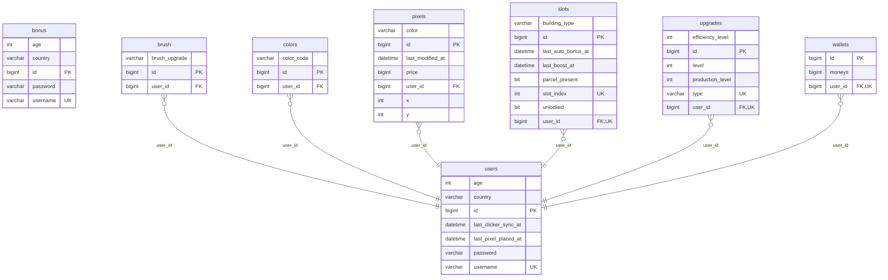

```mermaid
erDiagram
    bonus {
        int age 
        varchar country 
        bigint id PK 
        varchar password 
        varchar username UK 
    }

    brush {
        varchar brush_upgrade 
        bigint id PK 
        bigint user_id FK 
    }

    colors {
        varchar color_code 
        bigint id PK 
        bigint user_id FK 
    }

    pixels {
        varchar color 
        bigint id PK 
        datetime last_modified_at 
        bigint price 
        bigint user_id FK 
        int x 
        int y 
    }

    slots {
        varchar building_type 
        bigint id PK 
        datetime last_auto_bonus_at 
        datetime last_boost_at 
        bit parcel_present 
        int slot_index UK 
        bit unlocked 
        bigint user_id FK,UK 
    }

    upgrades {
        int efficiency_level 
        bigint id PK 
        int level 
        int production_level 
        varchar type UK 
        bigint user_id FK,UK 
    }

    users {
        int age 
        varchar country 
        bigint id PK 
        datetime last_clicker_sync_at 
        datetime last_pixel_placed_at 
        varchar password 
        varchar username UK 
    }

    wallets {
        bigint id PK 
        bigint moneys 
        bigint user_id FK,UK 
    }

    brush }o--|| users : "user_id"
    colors }o--|| users : "user_id"
    pixels }o--|| users : "user_id"
    slots }o--|| users : "user_id"
    upgrades }o--|| users : "user_id"
    wallets }o--|| users : "user_id"
```