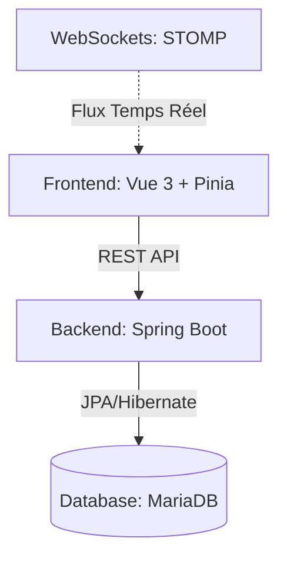

# Architecture de r/Place Clicker

Ce document détaille l'organisation technique et les choix technologiques du projet m1_dwa.

## 🏗️ Vue d'Ensemble

Le projet suit une architecture Client-Serveur classique, avec une séparation stricte entre la logique métier (Backend) et l'interface utilisateur (Frontend).

## 🛠️ Stack Technique

### Backend (Spring Boot)
- **Framework** : Spring Boot 3
- **Sécurité** : Spring Security + JWT (Stateless)
- **Données** : Spring Data JPA avec MariaDB
- **Temps Réel** : Spring WebSocket (STOMP)

### Frontend (Vue.js)
- **Framework** : Vue 3 (Composition API)
- **State Management** : Pinia
- **Client HTTP** : Axios
- **Rendu graphique** : Canvas HTML5 (Calculs de caméra et zoom personnalisés)
- **Typage** : TypeScript

## 📁 Structure des dossiers

- `/backend` : Contient le code source Java, la configuration Docker de la BDD et le `.env` de production.
- `/frontend` : Contient l'application Vue.js (`rplace-client`).

## 📡 Protocoles de Communication

1. **REST API** : Utilisé pour les actions ponctuelles (Login, récupération de la configuration, chargement initial du plateau, gestion du profil).
2. **WebSockets (STOMP)** : Utilisé pour la synchronisation en temps réel du plateau. 
    - `/app/place` : Destination pour poser un pixel (Authentifié).
    - `/topic/board` : Flux de diffusion de tous les pixels posés (Public).

## 🛡️ Sécurité
- L'authentification est gérée par un token JWT transmis dans le header `Authorization: Bearer <token>`.
- Les WebSockets utilisent un `ChannelInterceptor` pour valider le JWT lors de la connexion.
